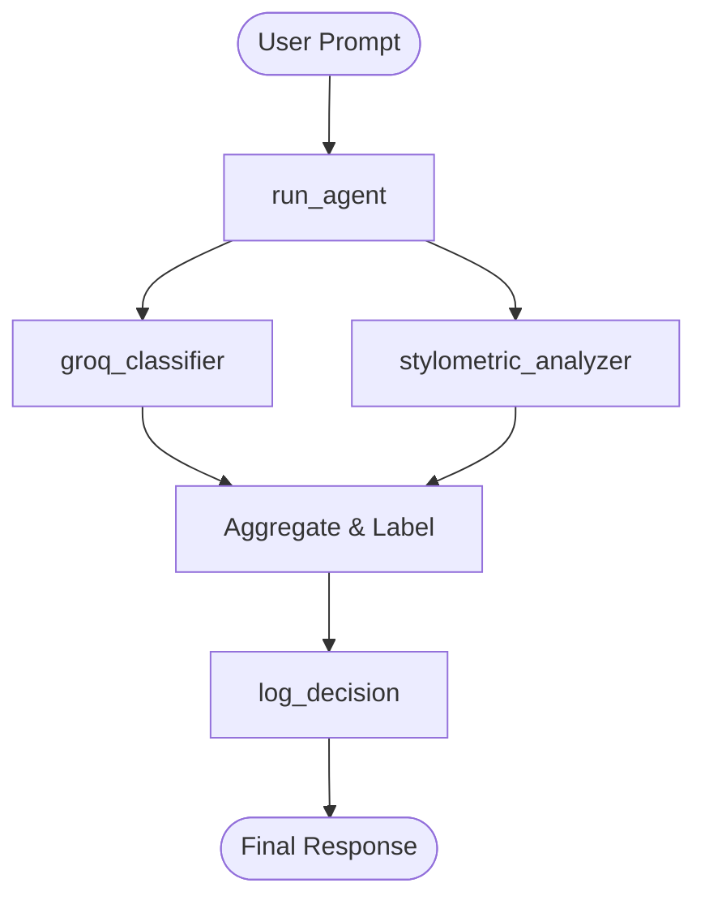

# Provenance Guard - Project Planning

## Project Overview
Provenance Guard is an AI-powered system designed to verify and trace the provenance of digital content. Using advanced language models and verification mechanisms, it helps ensure the authenticity and origin tracking of information.

## Core Features
1. **Content Verification** - Validate the authenticity of provided content
2. **Provenance Tracking** - Trace the origin and history of information
3. **AI-Powered Analysis** - Leverage Groq API for intelligent content analysis
4. **Rate Limiting** - Implement API rate limiting for security
5. **RESTful API** - Expose endpoints for verification and tracking

## Technology Stack
- **Backend**: Python Flask
- **LLM Provider**: Groq API
- **Rate Limiting**: Flask-Limiter
- **Environment Management**: python-dotenv

## Development Phases

### Phase 1: Setup & Infrastructure
- [x] Initialize project structure
- [ ] Configure Flask application
- [ ] Setup Groq API integration
- [ ] Implement rate limiting

### Phase 2: Core Features
- [ ] Build content verification endpoints
- [ ] Implement provenance tracking logic
- [ ] Create response formatting
- [ ] Add error handling

### Phase 3: Testing & Documentation
- [ ] Write unit tests
- [ ] Create API documentation
- [ ] Add usage examples
- [ ] Performance testing

## API Endpoints (Planned)

### POST /verify
Verify the authenticity of provided content.

**Request:**
```json
{
  "content": "text to verify"
}
```

**Response:**
```json
{
  "verified": true/false,
  "confidence": 0.0-1.0,
  "analysis": "detailed analysis"
}
```

### POST /trace
Trace the provenance of content.

**Request:**
```json
{
  "content": "text to trace",
  "depth": 3
}
```

**Response:**
```json
{
  "origin": "source information",
  "chain": ["step1", "step2", "step3"],
  "timestamp": "ISO timestamp"
}
```

## Installation
See README.md for setup instructions.

---

# Provenance Guard — Advanced Planning

## Tool Inventory
### Tool 1: `groq_classifier`
**What it does:** Uses the Groq LLM to analyze submitted text, returning an attribution score (0.0 to 1.0) and a confidence label.
**Input parameters:** `text` (str)
**What it returns:** Dict containing `attribution` ("likely_ai" or "likely_human"), `confidence` (float), and `label` (str).

### Tool 2: `stylometric_analyzer`
**What it does:** Computes structural properties of the text (Type-Token Ratio, sentence length variance) to calculate a heuristic probability of AI authorship.
**Input parameters:** `text` (str)
**What it returns:** `score` (float: 0.0 for human, 1.0 for AI).

### Tool 3: `log_decision`
**What it does:** Commits the final attribution, confidence, and signals to the SQLite audit log.
**Input parameters:** `decision_data` (dict).

---

## Planning Loop
1. **Initialize:** Parse `text` and `creator_id`.
2. **Detection:** Run `groq_classifier` and `stylometric_analyzer` in parallel.
3. **Score:** Aggregate scores; if combined score > 0.7 (AI), 0.3-0.7 (Uncertain), < 0.3 (Human).
4. **Log:** Call `log_decision` with all collected metrics.
5. **Respond:** Return transparency label and attribution status to user.

---

## State Management
A `session` object tracks the `content_id`, raw `text`, signal outputs, and final `attribution`. Each tool returns data to the `run_agent()` loop, which updates the `session` before calling the next tool.

## Error Handling
| Tool | Failure mode | Agent response |
|------|-------------|----------------|
| `groq_classifier` | API timeout | Fallback to stylometric-only scoring with an "Uncertain" label. |
| `log_decision` | Database busy | Queue for retry; return result to user regardless to ensure low latency. |

---

## Architecture


## Notes
- Ensure GROQ_API_KEY is set in .env file
- Rate limiting configuration may need tuning based on usage patterns
- All requests should include proper error handling
